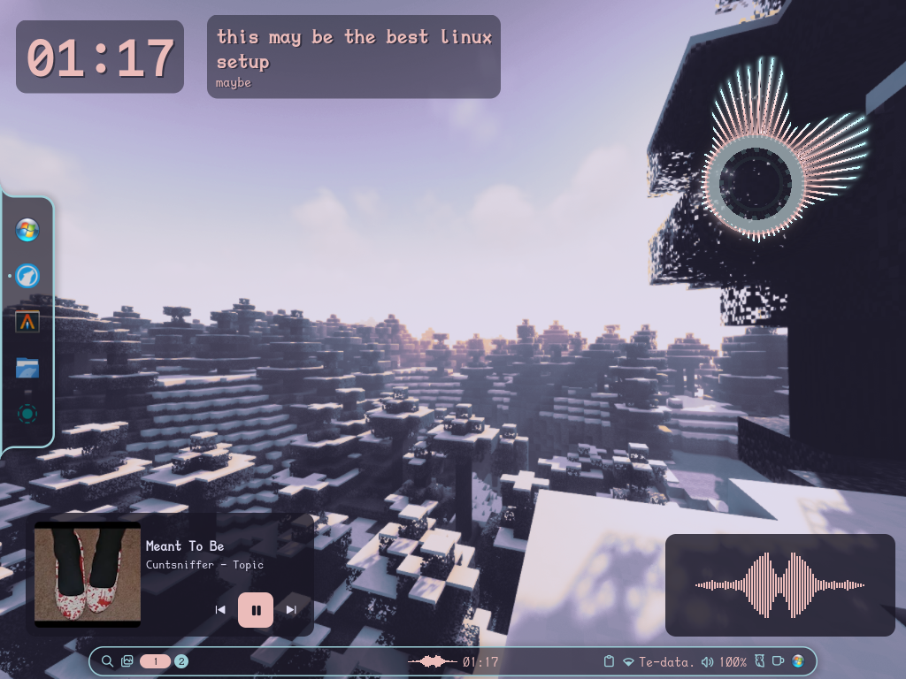

# my-sway-noctalia-shell-dots

My personal Sway desktop configuration featuring Noctalia shell, Alacritty, Btop, and Cava.



## Installation

### 1. Clone the repository
Ensure you have `git` installed, then clone the repository:

```bash
git clone [https://github.com/Christine-oss-web/my-sway-noctalia-shell-dots.git](https://github.com/Christine-oss-web/my-sway-noctalia-shell-dots.git)
cd my-sway-noctalia-shell-dots
cp -r ~/Downloads/alacritty ~/Downloads/btop ~/Downloads/cava ~/Downloads/sway ~/.config 

# then edit the configs to your liking and needs

# after that rename noctalia-config.toml to config.toml 

mv ~/Downloads/noctalia-config.toml ~/Downloads/config.toml

# then copy it 

cp ~/Downloads/config.toml ~/.config

# then delete all the folders and files from the repo that is on your Downloads folder 

rm -rf ~/Downloads/my-sway-noctalia-shell-dots 

# thats it 
